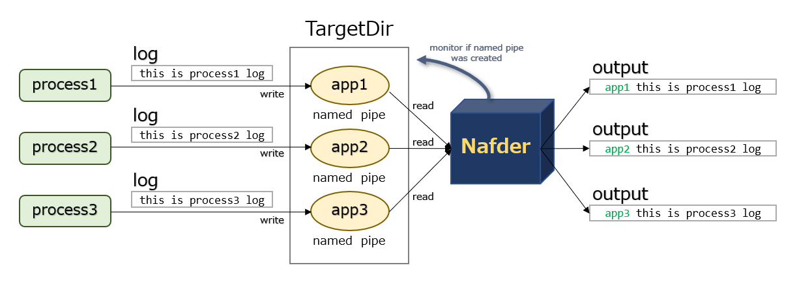

# Nafder

Nafder is a tool to identifying logs for container which has multi application.
It reads logs from named pipe, and outputs them with prefix.



## Usage

```
  $ nafder [options...] TargetDir
```

(ex)

terminal 1
```
# mkdir /var/run/nafder
# mkfifo /var/run/nafder/app1
# mkfifo /var/run/nafder/app2
# nafder /var/run/nafder
nafder INFO Reading /var/run/nafder/app1
nafder INFO Reading /var/run/nafder/app2
```

terminal 2
```
# echo foobar > /var/run/nafder/app1
# echo xxyyzz > /var/run/nafder/app1
```

-> nafder(terminal 1) output these logs
```
app1 foobar
app2 xxyyzz
```

### Options:

*  -c --copy    : Copy logs to specified file
*  -t --time    : Output timestamp
*  -d --debug   : Print debug messages
*  --version    : Show version number
*  -h --help    : Show help

### Environment Variables:

* NAFDER_DEBUG=true (default:false)
  * Print debug messages (=--debug option)

